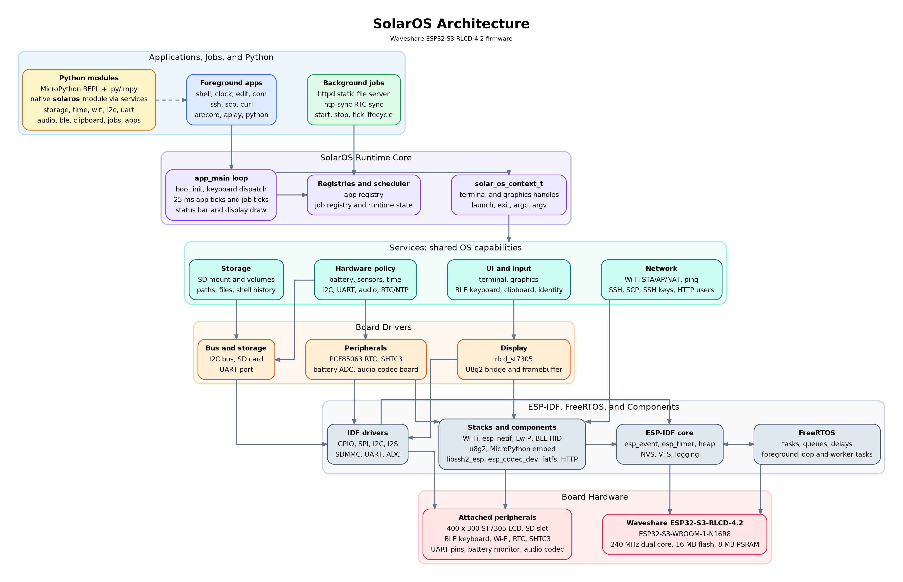

# SolarOS

SolarOS is a small text-first pocket terminal OS mainly for the Waveshare ESP32-S3-RLCD-4.2. It targets the reflective 400 x 300 display, BLE keyboard input, Wi-Fi, SD storage, SSH, serial I/O, and the onboard low-power peripherals.

The current firmware is still a single ESP-IDF image. Applications are built into the firmware and launched from the SolarOS shell, while persistent data, configuration, SSH keys, known hosts, shell history, and user files live on the SD card.

## Supported Boards

### Waveshare ESP32-S3-RLCD-4.2
- ESP32-S3-WROOM-1-N16R8
- 240 MHz dual-core CPU
- 16 MB QIO flash
- 8 MB octal PSRAM
- ST7305 reflective LCD, 400 x 300
- TF card slot over SDMMC 1-bit mode
- BLE HID keyboard input
- Wi-Fi station, SoftAP, APSTA, and NAT modes
- PCF85063 RTC
- SHTC3 temperature and humidity sensor
- Battery voltage ADC
- Exposed UART on U0TXD/GPIO43 and U0RXD/GPIO44
- I2C bus on SDA/GPIO13 and SCL/GPIO14
- Expansion port exposes GPIO0, GPIO1, GPIO2, GPIO3, GPIO17, and GPIO18. GPIO0 is also BOOT/download mode and GPIO18 is also the board KEY input.

## Build

This project uses PlatformIO with ESP-IDF through the pioarduino Espressif32 platform.

```sh
pio run
pio run -t upload
pio device monitor -b 115200
```

The SolarOS version is read from `version.txt` at build time.

## Firmware Flavors

SolarOS can be built from a flavor file in `flavors/`. The default is `flavors/full.toml`.

```sh
pio run
SOLAR_OS_FLAVOR=core pio run
```

Each flavor enables packages:

- `core`: Always enabled. Board hardware services, display/terminal, shell, SD storage, ports, logs, jobs framework, OTA, RTC/time, BLE keyboard, Wi-Fi control, battery, ADC, GPIO, PWM, I2C, UART, SHTC3 sensors, and the `audio` hardware command.
- `audio`: `arecord`, `aplay`, and MP3 decoding.
- `net`: Network tools/apps/jobs such as `ping`, `netscan`, `mqtt`, `ssh`, `scp`, `curl`, `web`, `chat`, `httpd`, `slip`, and `sshkey`.
- `media`: Image viewer and image decoder apps.
- `games`: Built-in games.
- `python`: MicroPython runtime. This currently also enables `net` because the Python module exposes network bindings.
- `lua`: Lua runtime. This is independent of `python` and does not pull in `net`.
- `utils`: Text editor, pagers, reader, clock, and serial terminal app.

Use `pkg` on the device to see the compiled flavor and package set. `version` also prints the active flavor.

## Input

Long-press the board `KEY` button to start BLE keyboard pairing. Pairing is remembered in NVS and SolarOS retries reconnects automatically when the keyboard becomes available again.

The application exit chord is `Ctrl+Alt+Del`. `Esc` is passed through to foreground applications such as SSH.

The shell and editor understand cursor keys, Page Up/Down, Home/End, and selected Ctrl/Shift navigation combinations. The editor also supports `Ctrl+A`, `Ctrl+C`, `Ctrl+X`, and `Ctrl+V` with a PSRAM-backed clipboard.

## Shell

SolarOS boots into a shell prompt:

```text
user@sol:/
```

If SD identity files are present, `/.shell/user` and `/.shell/hostname` override the default `user@sol` identity. The prompt tracks the current SD directory.

Useful shell behavior:

- `help` lists built-in shell commands.
- `pkg` shows the compiled firmware flavor and package set.
- `apps` lists foreground applications.
- Tab completes commands, subcommands, and filesystem paths where applicable.
- Up/Down browse command history.
- Left/Right edit the current command line.
- Page Up/Down scroll terminal history.
- Shell history is cached at `/.shell/history` when SD storage is available.
- `sh <file>` runs a simple SolarOS shell script from SD.
- `/.shell/startup` is run once when the shell first starts, if present.
- `/.shell/alias` defines simple command aliases, one per line.

Examples:

```text
ls -ah
cd /.ssh
watch -n 1 battery
job start batmon 60
python /scripts/status.py
ssh user@example-host
```

## Ports

SolarOS has a byte-stream port layer for serial-style endpoints. Ports can be claimed by exactly one owner at a time, so a CDC shell, UART shell, log stream, serial bridge, or SLIP/PPP job cannot accidentally write over another consumer.

Current ports:

- `cdc0`: USB serial/JTAG CDC byte stream.
- `uart0`: expansion UART on U0TXD/GPIO43 and U0RXD/GPIO44.

Use `port list` or `port status <name>` to inspect capabilities and ownership. Capability letters are `r` for read, `w` for write, and `c` for configurable.

Examples:

```text
port list
port status cdc0
job start shell cdc0
job start shell uart0
job stop shell
```

Port shells are VT100-style shells over the selected byte stream. Text-capable apps marked as port-capable can run there; display-only TUI/graphics apps remain on the board display. On a port shell, `Ctrl+]` is the foreground app exit key. On the display shell, the foreground app exit chord remains `CTRL+ALT+DEL`.

## Built-In Shell Commands

System:

- `version`
- `pkg`
- `status`
- `uptime`
- `sleep`
- `power [status|profile|idle|sleep]`: inspect power state, select power profile, configure display-shell idle sleep, or enter light sleep.
- `jobs`
- `job [status|start|stop]`: control background jobs; job-specific arguments follow the job name.
- `port [list|status]`: inspect registered byte-stream ports and current owners.
- `log [status|show|follow|clear|level|sink]`: inspect the SolarOS runtime log ring and control optional CDC mirroring.
- `mem`
- `top`
- `reboot`
- `clear`

Display, input, and identity:

- `setterm`: open the terminal settings TUI.
- `setterm orientation [0|90|180|270]`
- `setterm font [mono|compact]`
- `setterm textsize [12|14|16|18|20]`
- `setterm keyboard [us|de]`
- `setterm keyrate [off|1..60 [delay-ms]]`
- `setterm timezone [UTC|Europe/Berlin|POSIX-TZ]`
- `setterm otaurl [url]`

Storage and files:

- `sd [status|lsblk|mount|unmount]`: inspect SD partitions; mount extra FAT partitions with `sd mount sd0p2 /mnt/sd0p2`.
- `df`
- `cd`
- `ls`
- `cat`
- `sh`
- `watch [-n seconds] <command> [args...]`
- `mkdir`
- `rm`
- `mv`
- `cp`

Shell scripts are intentionally minimal. `sh <file>` reads the file line by line, skips blank lines and lines whose first non-space character is `#`, and runs each remaining line through the normal SolarOS shell command path. There are no variables, pipes, redirects, or quoting rules yet.

Shell aliases are defined in `/.shell/alias`. Each non-empty, non-comment line is `<alias> <command-or-app> [fixed args...]`; extra arguments typed after the alias are appended. For example, `delete rm *` makes `delete` run `rm *`. Aliases are re-read from SD when commands are executed or completed.

`watch` repeats a shell command or alias until `CTRL+ALT+DEL`, `ESC`, or `q` is pressed. For example, `watch -n 1 battery` refreshes the battery status once per second.

Hardware and sensors:

- `battery [status|config|capacity|min_voltage|max_voltage]`: read voltage, infer external power, and configure battery estimate limits.
- `gpio [status|list|mode|read|write]`: runtime user GPIO access is limited to GPIO1, GPIO2, GPIO3, and GPIO17.
- `adc [status|read]`: read analog voltage on ADC-capable runtime GPIOs.
- `pwm [status|set|off]`: generate LEDC PWM on runtime GPIOs.
- `i2c [status|speed|scan|probe|read|write]`
- `uart [status|baud|mode|write|read]`
- `audio [status|tone|level|mic|loopback|off]`: `level` shows/sets speaker volume; `mic` samples input level.
- `date [YYYY-MM-DD]`
- `time [HH:MM[:SS]]`
- `ntp [server]`
- `temperature`
- `humidity`

Power profiles:

- `power profile performance`: disables idle sleep.
- `power profile balanced`: disables idle sleep; this is the default.
- `power profile solar`: enables display-shell idle sleep after 300 seconds.
- `power profile offline`: enables display-shell idle sleep after 60 seconds.

`power idle [off|seconds]` overrides the profile idle timeout. Idle sleep currently applies only while the foreground app is the display shell, so SSH, editor, web, serial terminal, games, audio, and other foreground apps are not suspended unexpectedly.

Networking:

- `ble [status|scan|pair|forget]`: `scan` lists nearby BLE devices; `pair` starts the BLE keyboard pairing scan.
- `wifi`: open the Wi-Fi status/control TUI.
- `wifi [status|on|off|scan|connect|disconnect|forget|nat]`
- `wifi ap [status|on|off]`: start a SoftAP, including APSTA when station mode is also active.
- `wifi nat [status|on|off]`: enable or disable persistent IPv4 NAT for APSTA.
- `mqtt [status|connect|disconnect|publish|subscribe]`: MQTT/MQTTS client with broker URL and credentials stored in NVS.
- `ping <host>`
- `ota [status|check|upgrade|url|flavor|boot]`: inspect OTA partitions, check `version.txt`, stream `firmware.bin` into the inactive OTA slot, configure the OTA base URL or target flavor, or select an OTA slot to boot. The default base URL is `https://hypergraph.cloud/solaros/latest`; SolarOS appends the OTA target flavor, so the full flavor checks `latest/full/version.txt` and downloads `latest/full/firmware.bin`.
- `sshkey [status|gen|pub|rm]`

`wifi ap on [ssid [password [open|wpa|wpa2|wpa/wpa2]]]` starts an access point. Supplying an SSID saves the AP settings in NVS; later `wifi ap on` reuses the saved SSID/password/auth mode, or falls back to the default open AP when no saved AP exists. With no password it creates an open AP. With a password and no explicit auth mode it uses WPA2. ESP-IDF does not support WEP in SoftAP mode, so SolarOS rejects `wep` for AP mode.

`wifi nat on` saves NAT as enabled and activates it when both the station link and SoftAP are up. It stays in a waiting state until APSTA has an upstream IP address.

`mqtt connect mqtt://host[:port] [username [password]]` or `mqtt connect mqtts://host[:port] [username [password]]` saves the broker settings in NVS. Later `mqtt connect` reuses the saved URL and credentials without requiring an SD card.

## OTA Release Layout

OTA artifacts are flavor-aware. A release directory can hold several firmware flavors under the same version:

```text
solaros/
  1.6.0/
    full/
      version.txt
      firmware.bin
    core/
      version.txt
      firmware.bin
  latest -> 1.6.0
```

By default, the OTA target flavor is the flavor compiled into the running firmware. It can be changed from the device:

```text
ota flavor
ota flavor core
ota check
ota upgrade
```

With the default OTA URL, a device targeting `full` uses `https://hypergraph.cloud/solaros/latest/full/`, while a device targeting `core` uses `https://hypergraph.cloud/solaros/latest/core/`. If `ota url` is set directly to a `.bin` file, SolarOS treats that binary as exact and reads `version.txt` next to it. `ota check` reports an update when either the version differs or the target flavor differs from the currently running compiled flavor.

## Built-In Jobs

Jobs run in the background while a foreground app or shell remains active.

- `batmon`: Periodically sample battery voltage and estimate trend/time left. Start with `job start batmon [interval-sec]`; default is `60`. Voltage above `battery max_voltage` or a confirmed charging trend is external power. If three consecutive samples are at or below `battery min_voltage` while on battery, SolarOS requests light sleep.
- `bridge`: Raw bidirectional byte bridge between two ports. Start with `job start bridge <port-a> <port-b>`, for example `job start bridge cdc0 uart0`.
- `httpd`: Serve static files from a folder. Start with `job start httpd <folder>`; relative folders resolve under the default SD mount point.
- `log`: Stream SolarOS log entries to a byte-stream port or SD file. Start with `job start log <port> [error|warn|info|debug]` or `job start log file <path> [error|warn|info|debug]`.
- `ntp-sync`: Sync RTC time from NTP. Start with `job start ntp-sync [once] [interval-sec] [server]`; defaults are `60` and `pool.ntp.org`. With `once`, the job retries at the interval until the first successful sync, then stops itself.
- `shell`: Start a VT100 shell on a byte-stream port. Start with `job start shell <port>`.
- `slip`: Start an IPv4 SLIP gateway on a byte-stream port. Start with `job start slip [port] [baud] [local-ip] [peer-ip] [netmask]`; defaults are `uart0`, `115200`, `192.168.7.1`, `192.168.7.2`, and `255.255.255.252`. The peer should use the local IP as its gateway. NAT is enabled on the SLIP-facing interface.

Examples:

```text
job start bridge cdc0 uart0
job start slip uart0 115200
job start log cdc0
job start log uart0
job start log file /sdcard/.shell/log
job stop log
job status log
```

Only one instance of each built-in job is active at a time. Starting the same job name again stops the existing instance and starts it with the new arguments.

## Logs

SolarOS runtime messages go into a PSRAM-backed ring buffer by default. ESP-IDF boot and panic output still appears on CDC, but SolarOS-owned runtime logs are not mirrored to CDC unless enabled with `log sink cdc on`.

Use `log status` to see the current level, ring size, CDC mirror state, and dropped entry count. `log show [count]` prints recent entries. `log follow [level]` follows logs interactively in the current shell. Dedicated log jobs are better for persistent or external capture:

```text
job start log cdc0
job start log uart0 debug
job start log file /.shell/log info
```

The file form resolves shell-style paths, so `/.shell/log` and `/sdcard/.shell/log` both target the default SD card mount. If a port is already owned by a shell or another job, the log job will fail until that owner releases it.

## Built-In Applications

Applications are launched by typing their name at the shell prompt.

- `arecord`: Record native 16000 Hz stereo 16-bit PCM WAV audio to SD card.
- `aplay`: Play native 16000 Hz stereo 16-bit PCM WAV or MP3 audio from SD card.
- `clock`: Seven-segment clock, countdown alarm, and stopwatch. Use `clock` for time, `clock -a mm:ss` for a countdown alarm that beeps until quit, and `clock -s` for stopwatch mode.
- `python`: Interactive MicroPython shell, plus `.py` and `.mpy` script execution from SD card, with a PSRAM heap and a small `solaros` module.
- `lua`: Interactive Lua shell, plus `.lua` script execution from SD card, with PSRAM-first allocation and SolarOS service bindings.
- `ssh`: SSH client with UTF-8 terminal rendering, host key checking, password/key auth, `/.ssh/known_hosts`, and `/.ssh/hosts` lookup.
- `scp`: Copy files to or from a remote SSH server.
- `curl`: HTTP/HTTPS GET client with redirect support and optional SD card output.
- `edit`: Text editor for SD card files with navigation, selection, copy/cut/paste, and PSRAM buffer storage.
- `less`: Text file pager with wrapping and search.
- `reader`: Text file pager that remembers per-file position in `/.reader/positions`; `Ctrl++` and `Ctrl-` adjust reader text size.
- `com`: Serial terminal for the exposed UART pins.
- `view`: Image viewer for baseline/progressive JPG/JPEG, BMP, and Netpbm PBM/PGM/PPM files. Use `view [-fit|-actual] <image>`; `f` toggles fit/actual size and cursor keys pan.

Only one foreground application runs at a time. Apps use the SolarOS context and service APIs instead of talking directly to hardware drivers.

Application registry capabilities:

- `text`: Uses the shell I/O abstraction and can write line-oriented or terminal-oriented text.
- `graphics`: Uses the graphics service for full-screen drawing.
- `display`: Requires the board display and cannot run on a port-only shell.
- `port`: Can run through a byte-stream shell such as `cdc0` or `uart0`.

The built-in app registry stores each app name, summary, implementation pointer, capability flags, and current owner. The owner guard prevents the same foreground app from being launched simultaneously by the display shell and a port shell. The `apps` command lists registered foreground apps; future SD-loaded apps should merge into this same registry model.

`python` starts an interactive MicroPython prompt with `>>>` and `...` continuation prompts. `python <file.py|file.mpy> [args...]` runs a MicroPython script from SD. Script output is drawn in the SolarOS terminal, `sys.argv` contains the script path and following arguments, and `CTRL+ALT+DEL` exits at the prompt or requests `KeyboardInterrupt` while code is running.

The native `solaros` module exposes SolarOS services to MicroPython scripts. Top-level helpers include `write(text)`, `version()`, `should_exit()`, `battery_status()`, `wifi_status()`, and `environment()`. Service modules are grouped as `solaros.storage`, `solaros.time`, `solaros.battery`, `solaros.sensors`, `solaros.wifi`, `solaros.mqtt`, `solaros.gpio`, `solaros.adc`, `solaros.pwm`, `solaros.i2c`, `solaros.uart`, `solaros.audio`, `solaros.ble`, `solaros.clipboard`, `solaros.identity`, `solaros.net`, `solaros.ssh_keys`, `solaros.jobs`, `solaros.apps`, `solaros.tui`, and `solaros.gfx`.

See [SolarOS Python API](doc/solar_os_python.md) for the full module reference and examples.

`lua` starts an interactive Lua prompt. `lua <file.lua> [args...]` runs a Lua script from SD, with `arg[0]` set to the script path and following arguments stored from `arg[1]`. The embedded Lua library set includes base, coroutine, table, string, math, UTF-8, and debug. Host-facing Lua `io`, `os`, and dynamic package loading are intentionally not opened. SolarOS preloads a global `solaros` table and also supports `local solaros = require("solaros")` through a minimal built-in shim.

The Lua `solaros` API mirrors the Python service layout for storage, time, hardware services, Wi-Fi, audio, BLE, jobs, app registry, TUI, and graphics. Network-specific Lua modules such as `mqtt`, `net`, and `ssh_keys` are present when the `net` package is compiled.

See [SolarOS Lua API](doc/solar_os_lua.md) for the Lua module reference and examples.

Python example:

```python
import solaros

solaros.write("SolarOS " + solaros.version() + "\n")
print(solaros.battery.status())
print(solaros.storage.usage("/"))
print(solaros.apps.list())
```

Lua example:

```lua
local solaros = require("solaros")

solaros.write("SolarOS " .. solaros.version() .. "\n")
print(solaros.battery.status().percent)
print(solaros.storage.usage("/")["free_bytes"])
```

## SD Card Layout

The SD card is mounted at `/sdcard` internally and presented as `/` in shell paths.

Current conventional files:

- `/.shell/history`: bounded shell history cache.
- `/.shell/startup`: optional shell script run once at shell startup.
- `/.shell/alias`: optional shell aliases in `<alias> <command-or-app> [fixed args...]` form.
- `/.shell/user`: optional username for the shell prompt and SSH defaults.
- `/.shell/hostname`: optional host name for the shell prompt and SSH key comments.
- `/.reader/positions`: saved text reader offsets keyed by resolved file path.
- `/.ssh/known_hosts`: SSH host key database.
- `/.ssh/hosts`: static host aliases, one `ip-address hostname` mapping per line.
- `/.ssh/id_rsa` and `/.ssh/id_rsa.pub`: generated default SSH key pair.

## Architecture

The code is organized around the boundary that apps should use services, not board drivers.



```text
src/
  apps/           shell-launched foreground apps
  jobs/           background job registry
  drivers/        display, I2C, SD, RTC, sensors, UART, ADC, PWM
  services/       terminal, storage, time, sensors, BLE, Wi-Fi, SSH, SCP, GPIO, ADC, PWM
  solar_os.h      common app/job context and foreground app API
  solar_os_jobs.c background job lifecycle and tick dispatch
```

The shell command parser currently lives in the shell app. Board and build configuration live in `boards/`, `platformio.ini`, `sdkconfig.defaults`, and the Waveshare board header under `include/`.

The important rule is that drivers own hardware detail, services own policy, and apps and jobs use services. That lets shell commands, foreground applications, and background jobs share the same behavior for storage, terminal rendering, networking, identity, time, and input.

SolarOS runtime roles:

- Apps are foreground programs. One app runs at a time and may own the terminal, graphics surface, and input focus.
- Jobs are background tasks. They are started and stopped by name, receive periodic tick events, and should not write directly to the foreground UI. Jobs that need blocking I/O may create their own short-lived worker task.
- Services provide shared OS capabilities used by shell commands, apps, and jobs.
